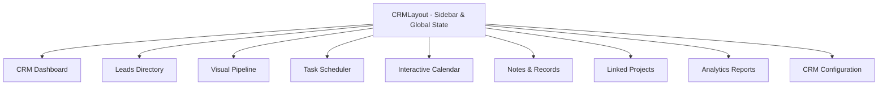

# OOMA CRM Engine - Complete Documentation & User Guide

Welcome to the **OOMA CRM Engine** (Customer Relationship Management) documentation. This system is a real-time, premium, and collaborative workspace designed to manage leads, pipelines, calendar events, notes, tasks, and project tracking in one seamless flow.

---

## 🏗️ CRM System Architecture & Modules

The OOMA CRM Engine is built with **React**, **TypeScript**, **Tailwind CSS**, and **Supabase (PostgreSQL + Real-time Channels)**. It is organized into 10 key interface workspaces:

### 1. 📊 CRM Dashboard (`CRMDashboard.tsx`)
* **Purpose:** The main operational control center.
* **Features:** 
  - Real-time key metrics cards: Total Deals Value, Active Leads, Task Completion Rate, and Conversion Rate.
  - Interactive charts visualizing sales metrics.
  - Quick action widgets (create lead, add note, view pending task notifications).

### 2. 👥 Leads Directory (`CRMLeads.tsx`)
* **Purpose:** Centralized registry for all potential clients and contacts.
* **Features:**
  - Standardized lead logging (Company name, client contact, email, status, value, source, rating).
  - Search, filter, and export capabilities.
  - Lead conversion pipeline triggers.

### 3. 📈 Interactive Pipeline (`CRMPipeline.tsx`)
* **Purpose:** Visual flow of leads through various stages of the conversion lifecycle.
* **Features:**
  - Visual status stages (e.g., *Contacted*, *Proposal Sent*, *Negotiation*, *Closed Won*, *Closed Lost*).
  - Easy stage transition updates which sync automatically with database logs.

### 4. 📋 Task Manager (`CRMTasks.tsx`)
* **Purpose:** Tracking items to be completed for specific leads or general CRM workflows.
* **Features:**
  - Create tasks and bind them to specific Lead profiles.
  - Real-time updates: whenever a task is assigned or marked completed, active users in the workspace get instant updates.

### 5. 📅 Workspace Calendar (`CRMCalendar.tsx`)
* **Purpose:** Visualized scheduling for follow-ups, calls, and project syncs.
* **Features:**
  - Monthly/weekly calendar views.
  - Directly add, edit, or drag calendar events.

### 6. 📝 Notes & Logs (`CRMNotes.tsx`)
* **Purpose:** Quick notes, minutes of meetings, or general client correspondence records.
* **Features:**
  - Rich text entries associated with lead timelines.

### 7. 💼 Integrated Projects (`CRMProjects.tsx`)
* **Purpose:** Bridge the gap between closing a lead and starting engineering implementation.
* **Features:**
  - Shows linked active workspace projects mapped to the client account.

---

## ⚡ Key Technical Features & Workflows

### 🛡️ Real-Time Notifications
The CRM layout maintains a live Supabase subscription channel (`layout_notifications`) listening to the `crm_tasks` table. 
* **Native Desktop Push Notifications:** Triggers via the browser's `Notification API`. When an inserter table trigger fires for a new task marked `Pending`, it immediately prompts the logged-in user.
* **Header Bell Indicator:** Shows a list of the 5 most recent pending items with direct shortcuts to search/find them in the pipeline.

### 🔗 Automatic Database Workroom Transition
When a user submits a stage in the engineering workroom page (`ProjectWorkspacePage.tsx`), the cache is busted via local storage throttle key clearance, and the interface automatically transitions the project layout to the appropriate workspace team room.

---

## 🚀 How to Use the CRM

### Step 1: Create a Lead
1. Navigate to the **Leads** workspace from the sidebar.
2. Click **Create Lead / Add Lead**.
3. Fill out the contact card, initial estimated deal value, and source. Save the record.

### Step 2: Progress the Deal in the Pipeline
1. Go to the **Pipeline** view.
2. Adjust lead stages as conversations progress. Updates write live to the database, ensuring all connected partners see the movement in real-time.

### Step 3: Assign Follow-up Tasks
1. Select the lead, or open the **Tasks** workspace.
2. Add a task description, set the due date, and assign it.
3. The system will broadcast a real-time notification to the team.

### Step 4: Convert to Active Project
1. Once a lead is successfully marked **Closed Won**, configure a project card in the main **Ooma Workspace** to transition it into active development phases.

---

## 🛠️ Configuration & Extension (For Developers)

* **Sidebar & Navigation:** Defined dynamically in [CRMLayout.tsx](file:///c:/Users/AJAYKUMAR/.gemini/antigravity-ide/scratch/omma-labs/src/components/crm/CRMLayout.tsx#L29-L39). You can add new routes by appending to the `navItems` array.
* **Database Connection:** Supabase queries use the custom supabase client defined in `src/lib/supabase.ts`.
* **Environment variables:** All Supabase connections rely on `.env` configuration keys:
  - `VITE_SUPABASE_URL`
  - `VITE_SUPABASE_ANON_KEY`
